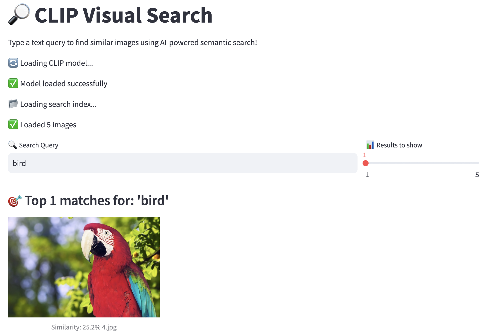

# CLIP Visual Search

Type a text query and retrieve the most similar images from a folder using **CLIP** embeddings and **FAISS** vector search.





  

## 🌟 Features

- **Semantic Search**: Find images using natural language queries
- **Fast Search**: FAISS-powered vector similarity search
- **Web UI**: Clean Streamlit interface for easy interaction
- **CLI Tools**: Command-line tools for batch processing
- **Memory Safe**: Robust implementation avoiding segmentation faults

## 🚀 Quickstart

### 1. Setup Environment

```bash
# Clone the repository
git clone <your-repo-url>
cd clip

# Create virtual environment (Python 3.11+ recommended)
python3.11 -m venv .venv
source .venv/bin/activate

# Install dependencies
pip install -r requirements.txt
```

### 2. Add Images

```bash
# Add your JPG/PNG images to the examples folder
cp your_images/* examples/
```

### 3. Build Search Index

```bash
# Build the FAISS index from your images
python src/build_index.py examples/
```

### 4. Search Images

**CLI Search:**
```bash
# Search using command line
python src/search.py "a red sports car"
python src/search.py "person with glasses"
python src/search.py "sunset over mountains"
```

**Web UI:**
```bash
# Run the Streamlit web interface
streamlit run src/app.py
```

Then open http://localhost:8501 in your browser!

## 📁 Project Structure

```
clip/
├── src/
│   ├── build_index.py    # Index builder with memory safety
│   ├── search.py         # CLI search tool
│   └── app.py           # Streamlit web UI
├── examples/            # Your image folder
├── requirements.txt     # Python dependencies
├── clip.index          # FAISS search index (generated)
├── paths.pkl           # Image paths (generated)
└── README.md
```

## 🛠️ Technical Details

### Architecture
- **CLIP Model**: `openai/clip-vit-base-patch32` for image/text embeddings
- **Vector Search**: FAISS IndexFlatIP for cosine similarity
- **Web Framework**: Streamlit for the user interface
- **Memory Management**: CPU-only processing with garbage collection

### Key Features
- **Cosine Similarity**: Proper semantic similarity measurement
- **Memory Safety**: Avoids segmentation faults through careful resource management
- **Error Handling**: Robust error handling and user feedback
- **Progress Tracking**: Clear status messages during processing

## 📊 Usage Examples

```bash
# Index a directory of images
python src/build_index.py /path/to/your/images/

# Search for specific concepts
python src/search.py "dog playing in park"
python src/search.py "blue vintage car"
python src/search.py "person wearing hat"

# Start the web interface
streamlit run src/app.py
```

## 🔧 Requirements

- Python 3.11+
- PyTorch (CPU version)
- Transformers
- FAISS-CPU
- Streamlit
- Pillow

See `requirements.txt` for exact versions.

## 🐛 Troubleshooting

### Segmentation Faults
- Ensure you're using Python 3.11+
- Use CPU-only processing (default in our implementation)
- Try rebuilding with `rm clip.index paths.pkl && python src/build_index.py examples/`

### Model Download Issues  
- Network timeouts are normal on first run
- Models are cached locally after first download
- Use `export HF_HUB_DOWNLOAD_TIMEOUT=60` for slower connections

### No Images Found
- Ensure images are in JPG, PNG, JPEG, BMP, or TIFF format
- Check file permissions in your images directory

## 🚀 Performance Tips

- **Batch Processing**: Use the CLI tools for large-scale processing
- **Memory Usage**: System uses CPU-only processing to avoid memory issues
- **Index Size**: FAISS index scales well to thousands of images

## 🤝 Contributing

1. Fork the repository
2. Create a feature branch
3. Make your changes with proper error handling
4. Test with various image types and queries
5. Submit a pull request

## 📝 License

This project is open source. Feel free to use and modify as needed.

## 🙏 Acknowledgments

- OpenAI for the CLIP model
- Facebook Research for FAISS
- Hugging Face for model hosting
- Streamlit for the web framework